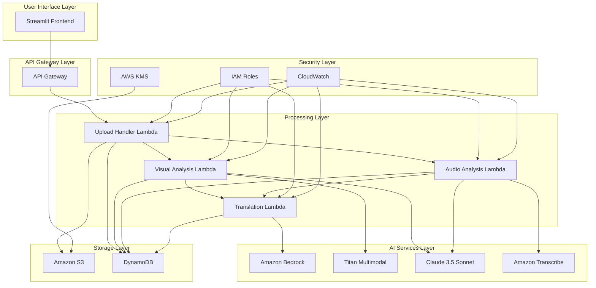
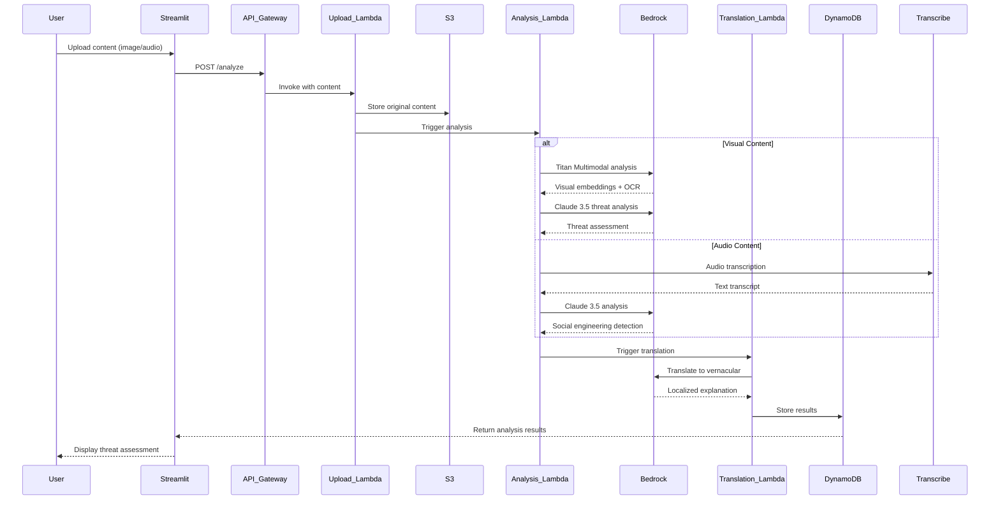

# Design Document: Saterix AI Security Agent

## Overview

Saterix is a serverless multimodal AI security agent designed to protect rural Indian communities from digital fraud and social engineering attacks. The system leverages AWS managed services to provide real-time analysis of visual content (screenshots, images) and audio content (voice recordings), delivering threat assessments in local vernacular languages.

The architecture follows a serverless, event-driven design using AWS Lambda for compute, Amazon Bedrock for AI processing, Amazon S3 for storage, and Streamlit for the user interface. This approach ensures cost-effectiveness, scalability, and minimal operational overhead while providing enterprise-grade security and compliance.

## Architecture

### High-Level Architecture



### Data Flow Architecture



## Components and Interfaces

### Frontend Component (Streamlit)

**Purpose**: Provides user interface for content upload and result display

**Key Features**:
- Mobile-responsive design optimized for smartphones
- Drag-and-drop file upload with progress indicators
- Language selection (Hindi, Bengali, Tamil, English)
- Color-coded threat level display (green/yellow/red)
- Real-time analysis status updates

**Interface Specifications**:
```python
class StreamlitInterface:
    def upload_content(self, file_type: str, max_size: int) -> UploadResult
    def display_analysis_results(self, results: AnalysisResult) -> None
    def set_language_preference(self, language: str) -> None
    def show_processing_status(self, status: ProcessingStatus) -> None
```

### Upload Handler Lambda

**Purpose**: Manages file uploads, validation, and orchestrates analysis workflow

**Key Responsibilities**:
- File format and size validation
- Secure upload to S3 with encryption
- Trigger appropriate analysis Lambda based on content type
- Generate unique request IDs for tracking

**Interface Specifications**:
```python
class UploadHandler:
    def validate_file(self, file: FileUpload) -> ValidationResult
    def store_content(self, file: FileUpload) -> S3Location
    def trigger_analysis(self, content_type: str, s3_location: str) -> AnalysisJob
    def generate_request_id(self) -> str
```

### Visual Analysis Lambda

**Purpose**: Processes images and screenshots for fraud detection

**Key Responsibilities**:
- Extract text using Amazon Titan Multimodal OCR capabilities
- Analyze visual elements (logos, formatting, QR codes)
- Generate fraud indicators and threat scores
- Validate UPI payment information

**Interface Specifications**:
```python
class VisualAnalyzer:
    def extract_text_and_visual_features(self, image_s3_path: str) -> VisualFeatures
    def detect_fraud_indicators(self, features: VisualFeatures) -> FraudIndicators
    def analyze_qr_codes(self, image_data: bytes) -> QRAnalysisResult
    def calculate_threat_score(self, indicators: FraudIndicators) -> ThreatScore
```

### Audio Analysis Lambda

**Purpose**: Processes voice recordings for social engineering detection

**Key Responsibilities**:
- Transcribe audio using Amazon Transcribe with Hindi/English support
- Detect social engineering keywords and patterns
- Analyze emotional manipulation tactics
- Generate confidence scores for threat detection

**Interface Specifications**:
```python
class AudioAnalyzer:
    def transcribe_audio(self, audio_s3_path: str) -> TranscriptionResult
    def detect_social_engineering_keywords(self, transcript: str) -> KeywordMatches
    def analyze_manipulation_tactics(self, transcript: str) -> ManipulationAnalysis
    def calculate_confidence_score(self, analysis: ManipulationAnalysis) -> ConfidenceScore
```

### Translation Lambda

**Purpose**: Converts threat explanations to vernacular languages

**Key Responsibilities**:
- Translate technical security terms to local languages
- Adapt explanations for rural Indian cultural context
- Ensure appropriate language complexity for target audience
- Support Hindi, Bengali, and Tamil output

**Interface Specifications**:
```python
class VernacularTranslator:
    def translate_threat_explanation(self, text: str, target_language: str) -> TranslationResult
    def localize_security_terms(self, terms: List[str], language: str) -> LocalizedTerms
    def adapt_cultural_context(self, explanation: str, region: str) -> ContextualizedText
    def validate_translation_quality(self, translation: str) -> QualityScore
```

## Data Models

### Content Upload Model
```python
@dataclass
class ContentUpload:
    request_id: str
    user_id: Optional[str]
    content_type: Literal["image", "audio"]
    file_format: str
    file_size: int
    s3_location: str
    upload_timestamp: datetime
    language_preference: str
    metadata: Dict[str, Any]
```

### Analysis Result Model
```python
@dataclass
class AnalysisResult:
    request_id: str
    content_type: str
    threat_detected: bool
    threat_score: float  # 0-100
    confidence_level: float  # 0-1
    fraud_indicators: List[FraudIndicator]
    explanation: str
    localized_explanation: str
    recommendations: List[str]
    analysis_timestamp: datetime
    processing_time_ms: int
```

### Fraud Indicator Model
```python
@dataclass
class FraudIndicator:
    indicator_type: str
    description: str
    severity: Literal["low", "medium", "high"]
    evidence: str
    confidence: float
    location: Optional[BoundingBox]  # For visual indicators
```

### Social Engineering Detection Model
```python
@dataclass
class SocialEngineeringDetection:
    keywords_detected: List[str]
    manipulation_tactics: List[str]
    urgency_indicators: List[str]
    authority_claims: List[str]
    emotional_triggers: List[str]
    confidence_score: float
    transcript_segments: List[TranscriptSegment]
```

### Threat Intelligence Model
```python
@dataclass
class ThreatIntelligence:
    known_fraud_patterns: List[FraudPattern]
    blacklisted_entities: List[str]
    social_engineering_scripts: List[str]
    upi_fraud_indicators: List[str]
    last_updated: datetime
    version: str
```

## Correctness Properties

*A property is a characteristic or behavior that should hold true across all valid executions of a system—essentially, a formal statement about what the system should do. Properties serve as the bridge between human-readable specifications and machine-verifiable correctness guarantees.*

### Property Reflection

After analyzing all acceptance criteria, several properties can be consolidated to eliminate redundancy:

- File validation properties (1.1, 2.1) can be combined into a single comprehensive file validation property
- Threat scoring properties (1.5, 2.5) can be unified as they both validate score ranges
- Performance properties (5.1, 5.2, 6.6) can be grouped by component type
- Multi-language support properties (3.1, 7.2, 7.5) can be consolidated into comprehensive language handling
- Storage and retrieval properties (4.1, 4.2, 4.4) can be combined into data integrity validation

### Core Properties

**Property 1: File Upload Validation**
*For any* uploaded file, the system should accept it if and only if it matches supported formats (JPEG, PNG, WebP for images; MP3, WAV, M4A for audio) and is within size limits (10MB for images, 25MB for audio)
**Validates: Requirements 1.1, 2.1**

**Property 2: Content Analysis Completeness**
*For any* uploaded content, when analysis is complete, the system should always provide a threat assessment with explanation text, specific reasons, and appropriate metadata
**Validates: Requirements 1.6, 2.6**

**Property 3: Threat Score Bounds**
*For any* threat analysis result, the threat score should be a numeric value between 0 and 100 inclusive, and confidence scores should be between 0 and 1 inclusive
**Validates: Requirements 1.5, 2.5**

**Property 4: OCR Text Extraction**
*For any* image containing text, the OCR system should extract readable text content that can be analyzed for fraud indicators
**Validates: Requirements 1.2**

**Property 5: Fraud Indicator Detection**
*For any* image containing known fraud patterns (suspicious logos, urgency markers, formatting inconsistencies), the system should identify and flag these indicators with appropriate confidence levels
**Validates: Requirements 1.3**

**Property 6: UPI QR Code Validation**
*For any* valid UPI QR code, the system should successfully decode payment information and validate merchant details against known fraud databases
**Validates: Requirements 1.4, 7.3, 8.3**

**Property 7: Audio Transcription Accuracy**
*For any* audio file in supported formats, the transcription system should produce text output that preserves the semantic meaning of the original speech
**Validates: Requirements 2.2**

**Property 8: Social Engineering Keyword Detection**
*For any* text containing known social engineering keywords ('Digital Arrest', 'Police', 'Bank Account Freeze', 'Immediate Action Required'), the system should detect and flag these terms with appropriate context
**Validates: Requirements 2.3, 8.4**

**Property 9: Manipulation Tactic Recognition**
*For any* text exhibiting emotional manipulation tactics or urgency-based pressure patterns, the system should identify and categorize these techniques
**Validates: Requirements 2.4**

**Property 10: Vernacular Language Support**
*For any* threat explanation, when a supported vernacular language (Hindi, Bengali, Tamil) is selected, the system should produce culturally appropriate translations with correct character encoding
**Validates: Requirements 3.1, 3.2, 3.4, 3.5**

**Property 11: Language Complexity Appropriateness**
*For any* generated recommendation or explanation, the language complexity should be suitable for users with limited digital literacy, using simple and clear terminology
**Validates: Requirements 3.3**

**Property 12: Data Storage Integrity**
*For any* uploaded content, the system should store it with a unique identifier, timestamp, and maintain retrievability with proper encryption at rest
**Validates: Requirements 4.1, 4.2, 4.3**

**Property 13: Audit Trail Completeness**
*For any* data access operation, the system should create and maintain audit log entries with timestamp, operation type, and user context
**Validates: Requirements 4.4**

**Property 14: Data Lifecycle Management**
*For any* stored file older than 90 days, the system should automatically purge it from storage while maintaining audit records of the deletion
**Validates: Requirements 4.5**

**Property 15: Processing Performance Bounds**
*For any* content within size limits (5MB images, 10MB audio), processing should complete within specified time limits (30 seconds for images, 60 seconds for audio)
**Validates: Requirements 5.1, 5.2**

**Property 16: Error Handling and Retry Logic**
*For any* failed analysis operation, the system should automatically retry up to 3 times before reporting a permanent failure to the user
**Validates: Requirements 5.4**

**Property 17: Queue Management Under Load**
*For any* system state with high load, incoming requests should be properly queued with estimated processing times provided to users
**Validates: Requirements 5.3**

**Property 18: Real-time Result Display**
*For any* completed analysis, results should be immediately available to the user interface without requiring manual refresh actions
**Validates: Requirements 5.5**

**Property 19: Threat Level Color Coding**
*For any* threat assessment result, the user interface should display appropriate color coding (green for low, yellow for medium, red for high threat levels) with consistent iconography
**Validates: Requirements 6.3**

**Property 20: Multilingual Error Handling**
*For any* error condition, the system should display error messages in the user's selected language preference
**Validates: Requirements 6.5**

**Property 21: Multi-platform Content Processing**
*For any* screenshot from supported platforms (WhatsApp, SMS, email, social media), the system should successfully process and analyze the content regardless of source formatting
**Validates: Requirements 7.1**

**Property 22: Multi-script Text Detection**
*For any* image containing text in Devanagari, Bengali, or Tamil scripts, the OCR system should successfully detect and extract the text for analysis
**Validates: Requirements 7.2**

**Property 23: Mixed Language Analysis**
*For any* content containing multiple languages, the system should analyze all detected languages and provide comprehensive results covering all linguistic elements
**Validates: Requirements 7.5**

**Property 24: Threat Intelligence Integration**
*For any* content analysis, the system should compare against current threat intelligence databases and flag matches with known fraud patterns or blacklisted entities
**Validates: Requirements 8.1, 8.3**

## Error Handling

### Error Categories and Response Strategies

**File Upload Errors**:
- Invalid file format: Return clear error message with supported formats list
- File size exceeded: Provide specific size limit information and compression suggestions
- Corrupted files: Attempt basic repair, fallback to user notification with re-upload request

**Processing Errors**:
- AI service timeouts: Implement exponential backoff retry with user notification
- OCR failures: Fallback to manual text extraction prompts for critical content
- Transcription errors: Provide confidence indicators and manual correction options

**Storage Errors**:
- S3 upload failures: Retry with different availability zones, maintain local cache
- Encryption errors: Fail securely, never store unencrypted sensitive data
- Database connection issues: Queue operations for retry, maintain system availability

**Translation Errors**:
- Unsupported language detection: Fallback to English with language detection confidence
- Cultural context failures: Provide generic security advice with cultural adaptation flags
- Character encoding issues: Implement robust UTF-8 handling with fallback rendering

**Performance Degradation**:
- High system load: Implement graceful degradation with reduced feature sets
- Memory constraints: Process content in chunks, implement streaming where possible
- Network issues: Provide offline capability indicators and retry mechanisms

### Error Recovery Mechanisms

**Automatic Recovery**:
- Retry failed operations up to 3 times with exponential backoff
- Fallback to alternative AI models if primary services are unavailable
- Cache successful results to reduce reprocessing needs

**User-Assisted Recovery**:
- Provide clear error explanations in user's preferred language
- Offer alternative upload methods for failed file transfers
- Enable manual verification for uncertain AI analysis results

**System Monitoring**:
- Real-time error rate monitoring with automated alerting
- Performance metrics tracking for proactive issue identification
- User feedback collection for continuous improvement

## Testing Strategy

### Dual Testing Approach

The testing strategy employs both unit testing and property-based testing to ensure comprehensive coverage:

**Unit Tests**: Focus on specific examples, edge cases, and error conditions including:
- Specific file format validation examples
- Known fraud pattern detection with sample images
- Social engineering keyword detection with example transcripts
- Translation accuracy for specific technical terms
- Error handling scenarios with mock failures

**Property-Based Tests**: Verify universal properties across all inputs including:
- File validation across randomly generated files of various formats and sizes
- Threat scoring consistency across diverse content samples
- OCR accuracy across different image qualities and text orientations
- Language detection and translation quality across content variations
- Performance bounds validation under various system loads

### Property-Based Testing Configuration

**Testing Framework**: Use Hypothesis for Python-based property testing with minimum 100 iterations per property test.

**Test Tagging**: Each property test must reference its design document property using the format:
**Feature: saterix-ai-security-agent, Property {number}: {property_text}**

**Coverage Requirements**:
- Each correctness property must be implemented by exactly one property-based test
- Unit tests complement property tests by covering specific edge cases and integration points
- Integration tests validate end-to-end workflows across multiple components

**Test Data Generation**:
- Generate diverse image content with varying fraud indicators
- Create audio samples with different accents and social engineering patterns
- Produce multilingual content for translation and analysis testing
- Simulate various system load conditions for performance testing

**Validation Criteria**:
- All property tests must pass consistently across multiple runs
- Performance properties must be validated under realistic load conditions
- Security properties must be tested with both valid and malicious inputs
- Accessibility properties must be validated across different user scenarios